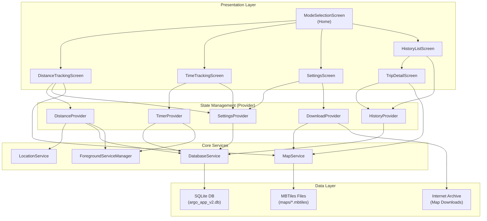
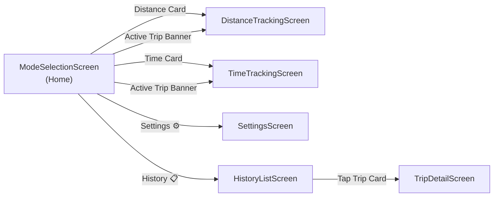
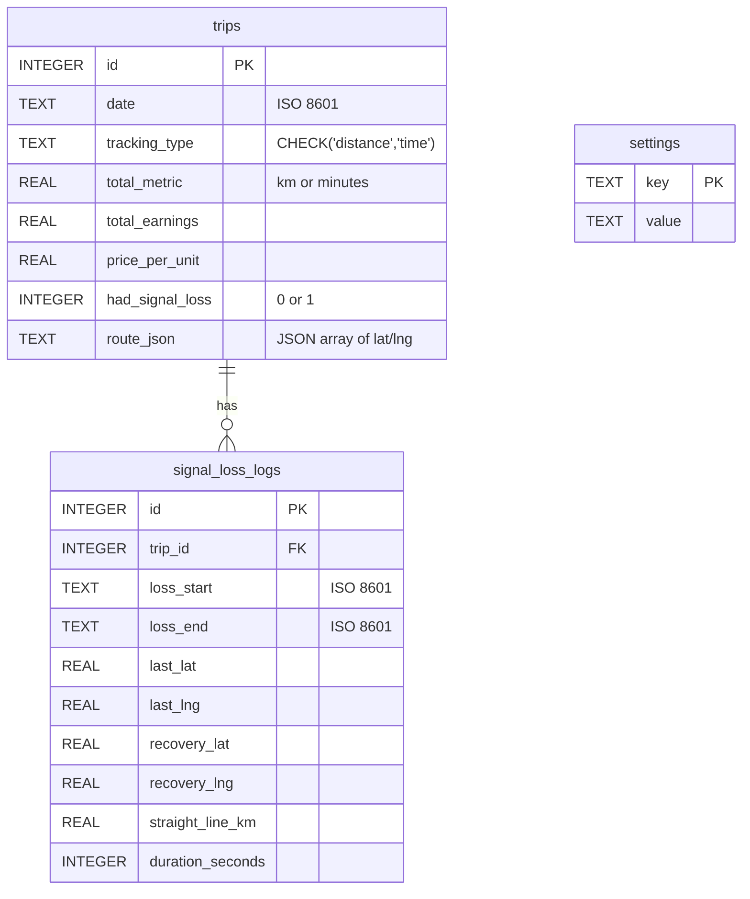
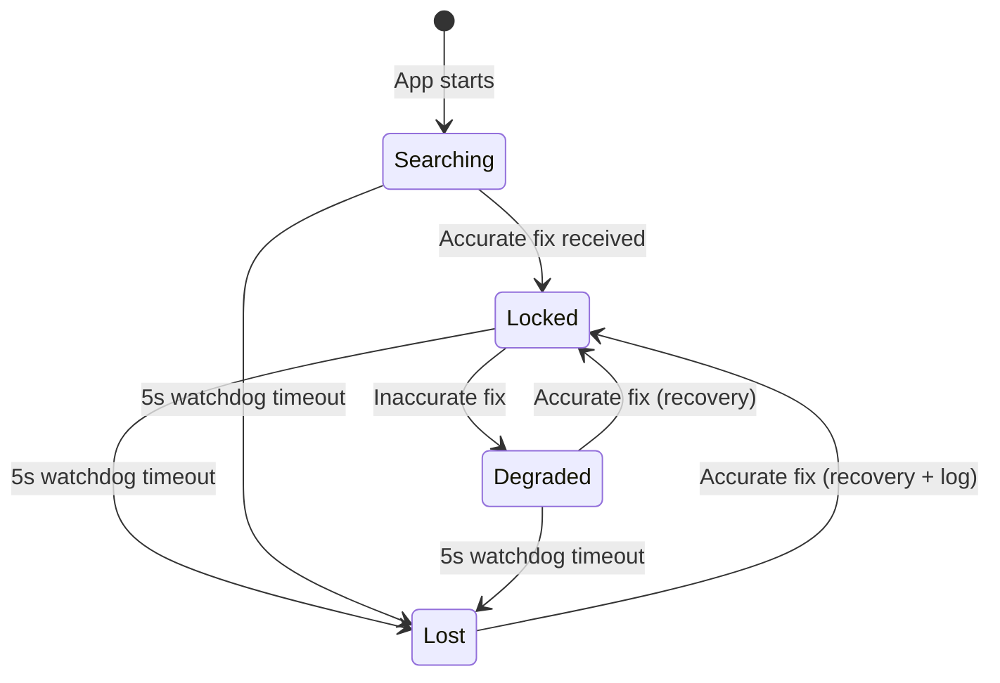
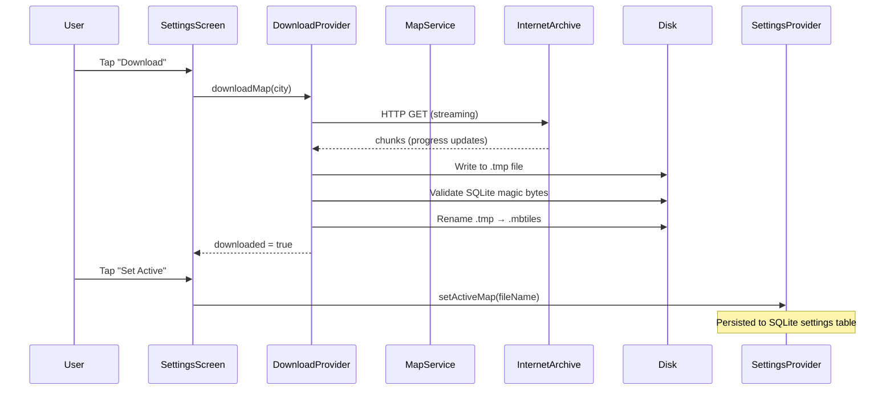
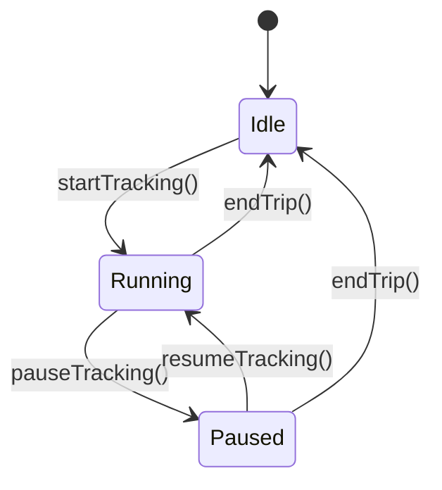

# Pagroo — System Architecture

## 1. High-Level Architecture



## 2. Project Structure

```
lib/
├── main.dart                          # App entry, MultiProvider setup, portrait lock
├── core/
│   ├── constants/                     # (empty — reserved)
│   ├── services/
│   │   ├── database_service.dart      # Singleton SQLite CRUD (trips, signal_loss_logs, settings)
│   │   ├── foreground_service_manager.dart  # Android FGS init, start/stop/update notification
│   │   ├── location_service.dart      # Geolocator permission check + position stream
│   │   └── map_service.dart           # CityMap model, MBTiles validation/open/delete
│   ├── theme/
│   │   └── app_theme.dart             # Material 3 dark/light ThemeData (Slate palette)
│   └── utils/
│       ├── currency_formatter.dart    # Indonesian Rupiah formatting (intl, id_ID locale)
│       └── haversine.dart             # Haversine distance via latlong2
├── features/
│   ├── tracking/
│   │   ├── providers/
│   │   │   ├── distance_provider.dart # GPS stream, distance calc, signal loss, trip save
│   │   │   └── timer_provider.dart    # Timer with pause/resume, fare calc, trip save
│   │   ├── screens/
│   │   │   ├── mode_selection_screen.dart   # Home: mode cards, active trip banner, clock
│   │   │   ├── distance_tracking_screen.dart # Map + HUD + Start/End Trip
│   │   │   └── time_tracking_screen.dart     # Clock + Fare + Start/End/Pause/Resume
│   │   └── widgets/                   # (empty — reserved)
│   ├── settings/
│   │   ├── providers/
│   │   │   └── settings_provider.dart # Rates, theme, active map (persisted)
│   │   └── screens/
│   │       └── settings_screen.dart   # Rate config, theme toggle, map management cards
│   ├── history/
│   │   ├── models/
│   │   │   ├── trip_record.dart       # TripRecord model (toMap/fromMap)
│   │   │   └── signal_loss_log.dart   # SignalLossLog model (toMap/fromMap)
│   │   ├── providers/
│   │   │   └── history_provider.dart  # Trip list, totals, delete, signal loss log fetch
│   │   └── screens/
│   │       ├── history_list_screen.dart # Trip list with stats header
│   │       └── trip_detail_screen.dart  # Detail view, static map, signal loss logs
│   └── onboarding/
│       └── providers/
│           └── download_provider.dart # HTTP download with progress, validation, delete
├── models/                            # (empty — reserved)
├── assets/
│   └── style.json                     # OpenMapTiles vector tile theme
└── test/
    ├── currency_formatter_test.dart   # Formatting unit tests
    ├── trip_reset_test.dart           # Trip state reset unit tests
    └── widget_test.dart               # Default Flutter widget test
```

## 3. Navigation Flow



There is no onboarding flow. The app launches directly into `ModeSelectionScreen`.

## 4. State Management

Provider (via `ChangeNotifier` + `MultiProvider`) is the sole state management solution.

| Provider | Scope | Key State |
|---|---|---|
| `SettingsProvider` | Global | `pricePerKm`, `pricePerMinute`, `isDarkMode`, `activeMapFileName` |
| `DistanceProvider` | Global | `totalKm`, `coordinates`, `signalStatus`, `isTracking`, `logs` |
| `TimerProvider` | Global | `elapsed`, `isPaused`, `isTracking`, `totalFare` |
| `HistoryProvider` | Global | `trips`, `totalEarnings`, `isLoading` |
| `DownloadProvider` | Global | Per-city: `downloaded`, `downloading`, `progress`, `error` |

All providers are registered in `main.dart` and live for the app's lifetime.

## 5. Database Schema



**Settings Keys**: `price_per_km`, `price_per_minute`, `is_dark_mode`, `active_map_file_name`.

## 6. GPS Signal Loss State Machine



On recovery from `Lost`/`Degraded`, straight-line Haversine distance is added and a `SignalLossLog` is created.

## 7. Map System Architecture



**Active Map Resolution** (`MapService.getActiveCity`):
1. If `selectedFileName` matches a downloaded city → return it.
2. Else, fall back to the first downloaded city.
3. If nothing downloaded → return `null` (blank canvas).

## 8. Foreground Service

The `flutter_foreground_task` package provides an Android Foreground Service that:
- Prevents the OS from killing the app during active GPS/timer tracking.
- Displays a persistent notification with live fare text.
- Uses a `TaskHandler` isolate (`MyTaskHandler`) — the main isolate pushes updates via `updateService()`.

**Service types declared in AndroidManifest**: `location|specialUse`.

## 9. Timer Pause/Resume Architecture



`elapsed` is computed as:
- **Running**: `_accumulatedDuration + (now - _resumeTime)`
- **Paused**: `_accumulatedDuration` (frozen)

The 1-second `Timer.periodic` continues ticking during pause but skips `notifyListeners()` and notification updates.
