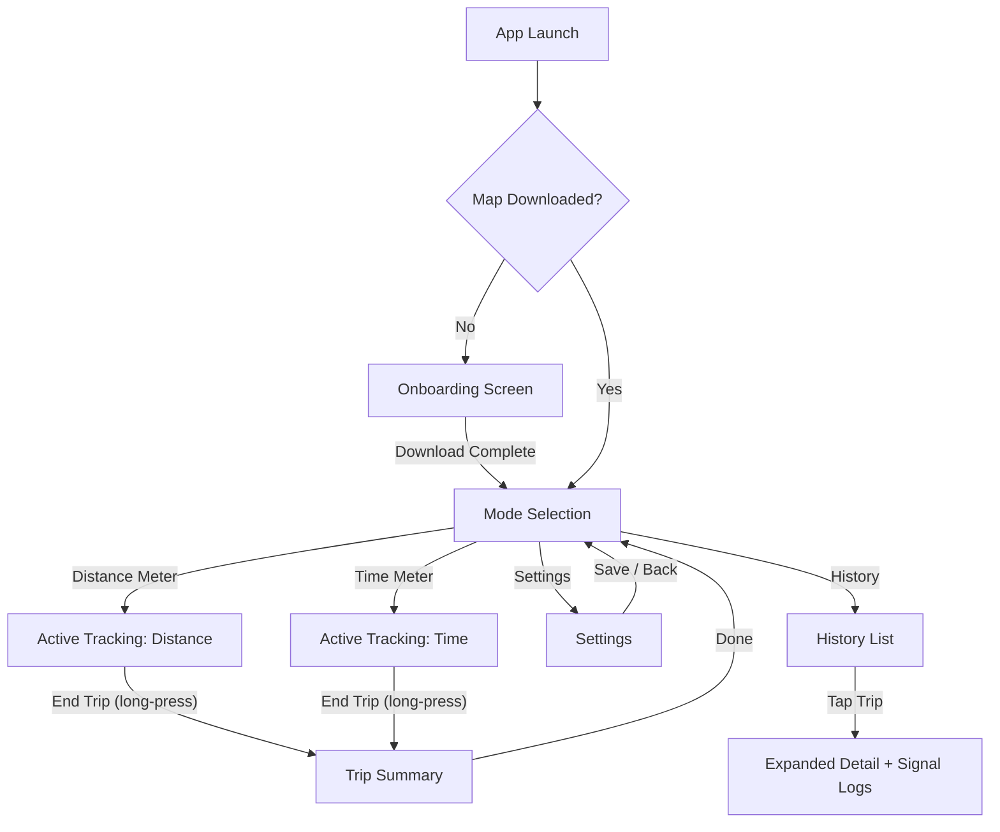

# Design Document
**Project Name:** Custom Offline Taximeter App (Argo App)  
**Platform:** Android (Flutter) · **Design Philosophy:** Driver-First, Glanceable, Offline  
**Design System:** Material 3 Dark + Custom High-Contrast Overrides  
**Typography:** Inter (Variable) · **Icons:** Material Symbols (Rounded)

---

## 1. Driver-Centric UX Principles

The user is a **rideshare driver operating a vehicle**. Every design decision must pass this filter: _"Can the driver read this in under 1 second without taking their eyes off the road for more than a glance?"_

### 1.1 Glanceability

| Rule | Standard | Rationale |
|------|----------|-----------|
| **Primary metric size** | ≥ 48sp (fare amount) | Readable from 50 cm arm's length while mounted on dashboard |
| **Secondary metric size** | ≥ 24sp (KM, time) | Peripheral vision readable |
| **Information density** | Max 3 data points per glance zone | Cognitive load < 1 second parse time |
| **Number formatting** | Thousands separator: `Rp 45.000` | Instant recognition of magnitude |
| **Monospace for metrics** | `Inter` tabular figures (`fontFeatures: [FontFeature.tabularFigures()]`) | Digits don't shift layout as values change |

### 1.2 Minimal Cognitive Load

| Rule | Standard |
|------|----------|
| **One primary action per screen** | Active tracking → "End Trip". Settings → "Save". Onboarding → "Download". |
| **No confirmation dialogs during driving** | "End Trip" uses a **long-press** (1.5 s) instead of a modal dialog to prevent accidental taps while eliminating dialog distraction |
| **Mode separation** | Distance and Time meters are completely independent screens—no tab switching mid-trip |
| **State persistence** | If app is killed mid-trip, restore state from last known values on relaunch |

### 1.3 High Contrast (Day / Night)

The app **defaults to dark mode** and supports an optional light mode. Dark mode is the primary theme because:
- Reduces windshield glare reflection at night
- OLED battery savings on Android
- Higher perceived contrast for bright text on dark backgrounds

| Element | Dark Mode | Light Mode |
|---------|-----------|------------|
| Background | `#0F172A` (Slate 900) | `#FFFFFF` |
| Card surface | `#1E293B` (Slate 800) | `#F8FAFC` (Slate 50) |
| Primary text (fare) | `#FFFFFF` | `#0F172A` |
| Secondary text (labels) | `#94A3B8` (Slate 400) | `#64748B` (Slate 500) |
| Accent (active state) | `#3B82F6` (Blue 500) | `#2563EB` (Blue 600) |
| Destructive (End Trip) | `#EF4444` (Red 500) | `#DC2626` (Red 600) |
| Success (GPS locked) | `#22C55E` (Green 500) | `#16A34A` (Green 600) |
| Warning (GPS degraded) | `#F59E0B` (Amber 500) | `#D97706` (Amber 600) |

> **Contrast ratios:** All primary text on background surfaces exceeds **7:1** (AAA). Secondary text exceeds **4.5:1** (AA). Destructive/Success on card surfaces exceed **4.5:1**.

### 1.4 Touch Targets (Fat-Finger Friendly)

| Element | Minimum Size | Rationale |
|---------|-------------|-----------|
| **Primary action buttons** (End Trip, Start) | **56 dp height**, full-width | Android Material guideline is 48 dp; we exceed because driver may be one-handing |
| **Mode selection cards** | **120 dp height** each | Must be tappable without precision |
| **Settings input fields** | **56 dp height** | Comfortable numeric keyboard entry |
| **Back / navigation icons** | **48 × 48 dp** hit area | Even if icon is 24 dp, hit area is padded |
| **Spacing between targets** | **≥ 12 dp gap** | Prevents mis-taps between adjacent elements |

---

## 2. Design System & Theming

### 2.1 Flutter ThemeData Configuration

```dart
// lib/core/theme/app_theme.dart

ThemeData darkTheme() => ThemeData(
  useMaterial3: true,
  brightness: Brightness.dark,
  scaffoldBackgroundColor: const Color(0xFF0F172A),
  colorScheme: const ColorScheme.dark(
    primary:       Color(0xFF3B82F6),  // Blue 500 — accent
    onPrimary:     Color(0xFFFFFFFF),
    secondary:     Color(0xFF334155),  // Slate 700
    onSecondary:   Color(0xFFFFFFFF),
    surface:       Color(0xFF1E293B),  // Slate 800 — cards
    onSurface:     Color(0xFFFFFFFF),
    error:         Color(0xFFEF4444),  // Red 500 — destructive
    onError:       Color(0xFFFFFFFF),
  ),
  cardTheme: CardThemeData(
    color: const Color(0xFF1E293B),
    elevation: 0,
    shape: RoundedRectangleBorder(borderRadius: BorderRadius.circular(16)),
  ),
  textTheme: const TextTheme(
    // Fare display — the most important number on screen
    displayLarge:  TextStyle(fontSize: 56, fontWeight: FontWeight.w700, height: 1.1),
    // KM / Time secondary metric
    displayMedium: TextStyle(fontSize: 32, fontWeight: FontWeight.w600, height: 1.2),
    // Section headers
    headlineMedium: TextStyle(fontSize: 20, fontWeight: FontWeight.w600),
    // Body text
    bodyLarge:     TextStyle(fontSize: 16, fontWeight: FontWeight.w400),
    // Labels, captions
    labelLarge:    TextStyle(fontSize: 14, fontWeight: FontWeight.w500, 
                             color: Color(0xFF94A3B8)),
  ),
  fontFamily: 'Inter',
);
```

### 2.2 Typography Scale

| Token | Size | Weight | Use |
|-------|------|--------|-----|
| `displayLarge` | 56 sp | Bold (700) | **Live fare amount** (`Rp 45.000`) |
| `displayMedium` | 32 sp | SemiBold (600) | **KM counter** (`3.4 km`), **Timer** (`01:23:45`) |
| `headlineMedium` | 20 sp | SemiBold (600) | Screen titles, section headers |
| `bodyLarge` | 16 sp | Regular (400) | Body text, descriptions |
| `labelLarge` | 14 sp | Medium (500) | Labels, metadata, captions |
| `labelSmall` | 12 sp | Medium (500) | Timestamps, tertiary info |

> **Critical:** All metric displays use `fontFeatures: [FontFeature.tabularFigures()]` to prevent layout jitter as numbers change.

### 2.3 Spacing Scale (8dp Grid)

| Token | Value | Use |
|-------|-------|-----|
| `--space-xs` | 4 dp | Icon-to-label gaps |
| `--space-sm` | 8 dp | Intra-component padding |
| `--space-md` | 16 dp | Card internal padding |
| `--space-lg` | 24 dp | Section spacing |
| `--space-xl` | 32 dp | Screen-level margins |
| `--space-2xl` | 48 dp | Major section breaks |

### 2.4 Iconography

- **Library:** Material Symbols (Rounded variant) — ships with Flutter, zero dependency
- **Icon size tokens:** `20 dp` (inline), `24 dp` (standard), `32 dp` (emphasis), `48 dp` (mode selection cards)
- **Signal indicator icons:** Custom — Green dot (locked), Amber triangle (degraded), Red X (lost)

### 2.5 Elevation & Borders

| Surface | Elevation | Border |
|---------|-----------|--------|
| Background | 0 | — |
| Card | 0 | `1px solid rgba(255,255,255,0.08)` |
| Bottom HUD sheet | 8 | Top `1px solid rgba(255,255,255,0.12)` |
| Floating button | 4 | — |
| Modal / Dialog | 16 | — |

---

## 3. Screen-by-Screen Component Breakdown

### 3.1 Onboarding — Mandatory Map Download

**Purpose:** Gate all tracking features until `east_java.mbtiles` is downloaded.

```
┌─────────────────────────────────────────┐
│              Status Bar                  │
├─────────────────────────────────────────┤
│                                         │
│         🗺️  (Map illustration)          │
│         64dp Material Symbol            │
│                                         │
│     "Offline Map Required"              │  ← headlineMedium
│                                         │
│     "Download the East Java region      │  ← bodyLarge, muted
│      map to enable offline tracking.    │
│      Covers Surabaya & Sidoarjo."       │
│                                         │
│  ┌─────────────────────────────────┐    │
│  │  East Java Region               │    │  ← Card
│  │  Estimated size: ~300 MB         │    │
│  │                                  │    │
│  │  ████████████░░░░░░  67%         │    │  ← LinearProgressIndicator
│  │  201 MB / 300 MB                 │    │  ← labelLarge
│  └─────────────────────────────────┘    │
│                                         │
│  ┌─────────────────────────────────┐    │
│  │    📥 Download via Wi-Fi         │    │  ← Primary button, 56dp
│  └─────────────────────────────────┘    │
│                                         │
│  ⚠️ "Connect to Wi-Fi before            │  ← Warning label
│     downloading"                        │
│                                         │
└─────────────────────────────────────────┘
```

**Components:**
| Widget | Type | Notes |
|--------|------|-------|
| `MapIllustration` | `Icon` (Material Symbol: `map`) | 64 dp, accent color |
| `RegionCard` | `Card` | Shows region name, file size estimate |
| `DownloadProgress` | `LinearProgressIndicator` + `Text` | Bound to `DownloadProvider.progress` |
| `DownloadButton` | `ElevatedButton` | Full-width, 56 dp. Disabled during download. Text changes: "Download" → "Downloading..." → "Complete ✓" |
| `WifiWarning` | `Row` (Icon + Text) | Visible when not connected to Wi-Fi |

**State flow:** `DownloadProvider` states: `idle` → `downloading` → `complete` → `error`. On `complete`, auto-navigate to Mode Selection.

**Mobbin References:**
| App | Pattern | Mobbin Search Query |
|-----|---------|---------------------|
| Google Maps | Offline area download with region preview + progress | `"offline map download progress with region selection"` |
| Organic Maps | Map download with linear progress and file size | `"file download progress screen with percentage bar"` |
| Spotify | First-launch gated download with prominent CTA | `"mandatory download screen before app can be used"` |

---

### 3.2 Mode Selection — Distance vs Time

**Purpose:** Choose which independent meter to use for the trip.

```
┌─────────────────────────────────────────┐
│              Status Bar                  │
├─────────────────────────────────────────┤
│  ⚙️                        "Argo"    📋 │  ← AppBar: Settings | Title | History
├─────────────────────────────────────────┤
│                                         │
│  ┌─ Current Rates ─────────────────┐    │
│  │  Rp 4.000/km  ·  Rp 500/min    │    │  ← Persistent rate banner
│  └─────────────────────────────────┘    │
│                                         │
│  "Select Tracking Mode"                 │  ← headlineMedium
│                                         │
│  ┌─────────────────────────────────┐    │
│  │  📍                              │    │  ← Mode Card A, 120dp height
│  │  Distance Meter                  │    │
│  │  "Track fare by GPS distance"    │    │
│  │                        Rp/km →   │    │
│  └─────────────────────────────────┘    │
│                                         │  ← 12dp gap
│  ┌─────────────────────────────────┐    │
│  │  ⏱️                              │    │  ← Mode Card B, 120dp height
│  │  Time Meter                      │    │
│  │  "Track fare by elapsed time"    │    │
│  │                        Rp/min →  │    │
│  └─────────────────────────────────┘    │
│                                         │
└─────────────────────────────────────────┘
```

**Components:**
| Widget | Type | Notes |
|--------|------|-------|
| `RateBanner` | `Card` | Reads from `SettingsProvider`. Shows active pricing. Tapping navigates to Settings. |
| `ModeCard` | `InkWell` + `Card` | 120 dp height, full-width. Left-aligned icon (48 dp), title (`headlineMedium`), subtitle (`bodyLarge`, muted). Ripple effect on tap. |
| `SettingsIconButton` | `IconButton` | Top-left, navigates to Settings screen |
| `HistoryIconButton` | `IconButton` | Top-right, navigates to History screen |

**Interaction:** Tapping a `ModeCard` navigates to the corresponding Active Tracking Screen. The card has a `selected` border state (accent blue, 2px) during press with elevation change from 0 → 4.

**Mobbin References:**
| App | Pattern | Mobbin Search Query |
|-----|---------|---------------------|
| Uber Driver | Service type selection with large option cards | `"mode selection screen with two large option cards to choose between"` |
| Grab Driver | Driver job type selector with card-based choices | `"service type choice card selection with icons"` |
| Gojek Driver | Service type choice cards with descriptive subtitles | `"two option card selection with icon and description"` |

---

### 3.3 Active Tracking — Distance Mode

**Purpose:** Live distance tracking with offline map, fare accumulation, and GPS signal transparency.

```
┌─────────────────────────────────────────┐
│              Status Bar                  │
├─────────────────────────────────────────┤
│                                         │
│                                         │
│          ┌─────────────────┐            │
│          │    MAP VIEW      │            │  ← flutter_map + MBTiles
│          │   (flutter_map)  │            │     60% of screen height
│          │                  │            │
│          │   📍 ~~~~ route  │            │     Polyline trace of trip
│          │                  │            │
│          └─────────────────┘            │
│                                         │
├─── Bottom HUD Sheet (non-dismissible) ──┤  ← elevation: 8, rounded top
│                                         │
│  🟢 GPS Locked · 4m accuracy            │  ← Signal indicator row
│                                         │
│         Rp 45.000                       │  ← displayLarge (56sp), WHITE
│                                         │
│    3.4 km          Rp 4.000/km          │  ← displayMedium | labelLarge
│                                         │
│  ┌─────────────────────────────────┐    │
│  │  ■■■■ HOLD TO END TRIP ■■■■■■  │    │  ← Destructive, full-width
│  └─────────────────────────────────┘    │     56dp, long-press 1.5s
│                                         │
└─────────────────────────────────────────┘
```

**Components:**
| Widget | Type | Notes |
|--------|------|-------|
| `MapView` | `FlutterMap` | Consumes `MapService.openTileStore()`. Shows `Polyline` layer from `DistanceProvider.coordinates`. Auto-centers on current position. |
| `SignalIndicator` | `Row` (Icon + Text) | Green dot = locked (< 20m accuracy). Amber triangle = degraded (20–50m). Red X = lost (> 50m or no signal > 5s). Audio beep on state change via `DistanceProvider.signalStatus`. |
| `FareDisplay` | `Text` | `displayLarge`, white, `tabularFigures`. Reads `DistanceProvider.totalFare`. Formatted as `Rp XX.XXX`. |
| `DistanceDisplay` | `Text` | `displayMedium`. Reads `DistanceProvider.totalKm`. Formatted as `X.X km`. |
| `RateLabel` | `Text` | `labelLarge`, muted. Shows active rate from `SettingsProvider`. |
| `EndTripButton` | `GestureDetector` (long-press) | Full-width, 56 dp, `error` color. Fills left-to-right over 1.5 s during hold. On complete: stops tracking, saves to DB, navigates to Trip Summary. |
| `BottomHUD` | `Container` | Non-dismissible persistent sheet. Top border radius 20 dp. Background: card surface color. |

**Signal Loss Banner (conditional):**
When `DistanceProvider.signalStatus == SIGNAL_LOST`, a warning banner slides in above the HUD:
```
┌─────────────────────────────────────────┐
│  ⚠️ GPS Signal Lost                     │  ← Amber background
│  Straight-line recovery will be applied  │
│  when signal returns.                    │
└─────────────────────────────────────────┘
```

**Mobbin References:**
| App | Pattern | Mobbin Search Query |
|-----|---------|---------------------|
| Uber Driver | Active trip with map overlay and bottom fare HUD | `"Uber driver active trip screen showing fare amount and trip distance"` |
| Grab Driver | Driver in-transit navigation with metric display | `"navigation map screen with large timer and distance overlay"` |
| Gojek Driver | Ride in-progress with map and fare overlay | `"ride hailing active trip map with fare overlay"` |

---

### 3.4 Active Tracking — Time Mode

**Purpose:** Distraction-free elapsed time display with live fare. No map needed.

```
┌─────────────────────────────────────────┐
│              Status Bar                  │
├─────────────────────────────────────────┤
│                                         │
│                                         │
│                                         │
│                                         │
│           01:23:45                       │  ← displayLarge (56sp)
│                                         │     Monospace tabular figures
│           ELAPSED                        │  ← labelLarge, muted
│                                         │
│                                         │
│         Rp 41.500                       │  ← displayMedium (32sp)
│                                         │
│         Rp 500/min                      │  ← labelLarge, muted
│                                         │
│                                         │
│  ┌─ Wakelock ──────────────────────┐    │
│  │  🔒 Screen stays awake          │    │  ← Chip, accent border
│  └─────────────────────────────────┘    │
│                                         │
│  ┌─────────────────────────────────┐    │
│  │  ■■■■ HOLD TO END TRIP ■■■■■■  │    │  ← Destructive, full-width
│  └─────────────────────────────────┘    │     56dp, long-press 1.5s
│                                         │
└─────────────────────────────────────────┘
```

**Components:**
| Widget | Type | Notes |
|--------|------|-------|
| `ElapsedTimer` | `Text` | `displayLarge`, white, monospace tabular figures. Format: `HH:MM:SS`. Value: `DateTime.now().difference(_startTime)` — Doze-proof. |
| `TimeFareDisplay` | `Text` | `displayMedium`. Reads `TimerProvider.totalFare`. |
| `RateLabel` | `Text` | `labelLarge`, muted. Active time rate. |
| `WakelockChip` | `Chip` | Accent-bordered, shows lock icon. Confirms `WakelockPlus` is active. |
| `EndTripButton` | Same as Distance mode | Identical long-press behavior. |

**Layout:** Centered vertically. Maximum 3 pieces of information visible: Time, Fare, Rate. Pure OLED-black background (`#0F172A`) for zero distraction during night driving.

**Mobbin References:**
| App | Pattern | Mobbin Search Query |
|-----|---------|---------------------|
| Uber Driver | Driver navigation with large timer and metric overlay | `"navigation map screen with large timer and distance overlay"` |
| Peloton | Large centered timer with minimal surrounding UI | `"workout timer screen with large countdown display"` |
| Waze | Drive mode HUD with minimal distraction layout | `"driving mode heads up display minimal interface"` |

---

### 3.5 Settings — Custom Pricing

**Purpose:** Configure price-per-km and price-per-minute. Persisted in SQLite `settings` table.

```
┌─────────────────────────────────────────┐
│  ←  Settings                             │  ← AppBar with back
├─────────────────────────────────────────┤
│                                         │
│  DISTANCE RATE                          │  ← labelLarge, muted
│  ┌─────────────────────────────────┐    │
│  │  Rp  [    4.000          ] /km  │    │  ← TextFormField, 56dp
│  └─────────────────────────────────┘    │
│                                         │
│  Quick set:                             │
│  [ Rp 3.000 ] [ Rp 4.000 ] [ Rp 5.000 ]│  ← ChoiceChip row
│  [ Rp 6.000 ] [ Rp 7.500 ]             │
│                                         │
│  ─────────────────────────────────────  │  ← Divider
│                                         │
│  TIME RATE                              │  ← labelLarge, muted
│  ┌─────────────────────────────────┐    │
│  │  Rp  [      500          ] /min │    │  ← TextFormField, 56dp
│  └─────────────────────────────────┘    │
│                                         │
│  Quick set:                             │
│  [ Rp 300 ] [ Rp 500 ] [ Rp 750 ]      │  ← ChoiceChip row
│  [ Rp 1.000 ]                           │
│                                         │
│                                         │
│  ┌─────────────────────────────────┐    │
│  │        💾  Save Settings         │    │  ← Primary button, 56dp
│  └─────────────────────────────────┘    │
│                                         │
└─────────────────────────────────────────┘
```

**Components:**
| Widget | Type | Notes |
|--------|------|-------|
| `PriceInputField` | `TextFormField` | `keyboardType: TextInputType.number`. Prefix: `Rp`. Suffix: `/km` or `/min`. Height: 56 dp. Focus outline: accent blue. Thousands-separator formatting on input via `TextInputFormatter`. |
| `QuickSetChips` | `Wrap` + `ChoiceChip` | Pre-defined common rates. Tapping auto-fills the input. Selected state: accent fill. Minimum 48 dp touch target per chip. |
| `SaveButton` | `ElevatedButton` | Full-width, 56 dp. Calls `SettingsProvider.save()` which writes to `DatabaseService.setSetting()`. Shows snackbar on success. |

**Validation:** Only positive integers. Show inline error below input if invalid. Save button disabled if any field is empty or invalid.

**Mobbin References:**
| App | Pattern | Mobbin Search Query |
|-----|---------|---------------------|
| Uber Driver | Rate/pricing configuration with labeled inputs | `"settings screen with price input fields and currency configuration"` |
| Revolut | Currency input with prefix and numeric keyboard | `"currency input field with prefix symbol"` |
| Wise | Transfer amount input with denomination chips | `"amount input with quick preset chips"` |

---

### 3.6 History & Transparency

**Purpose:** Browse past trips. Expand individual trips to see GPS signal loss transparency logs.

```
┌─────────────────────────────────────────┐
│  ←  Trip History                         │  ← AppBar with back
├─────────────────────────────────────────┤
│                                         │
│  ┌─ Summary ───────────────────────┐    │
│  │  12 Trips  ·  48.3 km  ·        │    │  ← Summary KPI banner
│  │  Rp 312.500 total               │    │
│  └─────────────────────────────────┘    │
│                                         │
│  Today, 7 Sep 2026                      │  ← Date group header
│  ┌─────────────────────────────────┐    │
│  │  📍 Distance Trip     14:32      │    │  ← Trip card
│  │  3.4 km · Rp 13.600              │    │
│  │  ⚠️ 1 signal loss event          │    │  ← Warning badge (if any)
│  │                            ▼     │    │  ← Expand chevron
│  └─────────────────────────────────┘    │
│                                         │
│  ┌─ Expanded Detail ───────────────┐    │  ← AnimatedContainer
│  │  GPS Transparency Log            │    │
│  │  ──────────────────────────────  │    │
│  │  Signal lost:  14:35:12          │    │
│  │  Signal back:  14:35:28          │    │
│  │  Duration:     16 seconds        │    │
│  │  ──────────────────────────────  │    │
│  │  Last known:   -7.2575, 112.7521 │    │
│  │  Recovery:     -7.2582, 112.7534 │    │
│  │  ──────────────────────────────  │    │
│  │  Straight-line: 0.15 km          │    │  ← Haversine distance
│  │  (Haversine fallback applied)    │    │  ← Transparency note
│  └─────────────────────────────────┘    │
│                                         │
│  ┌─────────────────────────────────┐    │
│  │  ⏱️ Time Trip          09:15      │    │  ← Trip card (no signal log)
│  │  45 min · Rp 22.500              │    │
│  └─────────────────────────────────┘    │
│                                         │
└─────────────────────────────────────────┘
```

**Components:**
| Widget | Type | Notes |
|--------|------|-------|
| `SummaryBanner` | `Card` | Aggregated stats from `HistoryProvider`. Total trips, total km, total earnings. |
| `DateGroupHeader` | `Text` | `labelLarge`, muted. Groups trips by date. |
| `TripCard` | `Card` + `InkWell` | Shows icon (📍 or ⏱️ based on `tracking_type`), time, metric, earnings. If `had_signal_loss == 1`, shows amber warning badge. Tappable to expand. |
| `SignalLossDetail` | `AnimatedContainer` / `ExpansionTile` | Slides open on tap. Lists each `signal_loss_log` entry: timestamps, coordinates, Haversine distance, duration. |
| `TransparencyNote` | `Text` | Italic, muted. "(Haversine fallback applied)" — makes it explicit this distance was estimated, not GPS-measured. |

**Data source:** `HistoryProvider.getTrips()` → `ListView.builder`. On expand, `HistoryProvider.getTripWithLogs(tripId)` fetches associated `signal_loss_logs`.

**Mobbin References:**
| App | Pattern | Mobbin Search Query |
|-----|---------|---------------------|
| Uber Driver | Driver earnings summary with daily trip breakdown | `"ride hailing driver app earnings summary with trip history list"` |
| Grab Driver | Trip history list with expandable trip details | `"trip history list with expandable detail view"` |
| Lyft Driver | Weekly earnings with per-trip metric cards | `"driver earnings breakdown with individual trip cards"` |

---

## 4. Consolidated Mobbin Reference Map

Quick lookup of all referenced patterns by screen:

| Screen | Reference Apps | Key Pattern |
|--------|---------------|-------------|
| **Onboarding** | Google Maps, Organic Maps, Spotify | Region card + linear progress + gated CTA |
| **Mode Selection** | Uber Driver, Grab Driver, Gojek | Dual large choice cards + rate banner |
| **Distance Tracking** | Uber Driver, Grab Driver, Gojek | Map + bottom HUD sheet + massive fare |
| **Time Tracking** | Uber Driver, Peloton, Waze | Centered timer + dark canvas + wakelock |
| **Settings** | Uber Driver, Revolut, Wise | Grouped inputs + preset chips + save CTA |
| **History** | Uber Driver, Grab Driver, Lyft | Summary banner + chronological cards + expandable detail |

> **How to use:** Search each Mobbin query on [mobbin.com](https://mobbin.com) to find the specific screen patterns. Filter by iOS platform for the highest quality driver-app references.

---

## 5. Navigation Flow



---

## 6. Flutter-Specific Implementation Notes

### 6.1 Theme Access Pattern
```dart
// Always use Theme.of(context), never hardcode colors
final theme = Theme.of(context);
Text(
  'Rp 45.000',
  style: theme.textTheme.displayLarge?.copyWith(
    fontFeatures: [FontFeature.tabularFigures()],
  ),
);
```

### 6.2 Responsive Bottom HUD
The tracking screen bottom HUD uses `DraggableScrollableSheet` with `snap: true` and `minChildSize: 0.35` to ensure the fare is always visible. The map occupies the remaining top portion.

### 6.3 End Trip Long-Press Widget
```dart
// Conceptual structure for the hold-to-end button
GestureDetector(
  onLongPressStart: (_) => _startFillAnimation(),    // 1.5s fill
  onLongPressEnd: (_) => _cancelOrComplete(),
  child: AnimatedContainer(
    // Red fill progresses left-to-right during hold
  ),
)
```

### 6.4 Wakelock Lifecycle (Both Tracking Screens)
```dart
// Applied in BOTH distance_tracking_screen.dart AND time_tracking_screen.dart
@override
void initState() {
  super.initState();
  WakelockPlus.enable();  // Screen stays on during trip
}

@override
void dispose() {
  WakelockPlus.disable(); // Release on exit
  super.dispose();
}
```

### 6.5 Portrait Lock (App-Wide)
```dart
// main.dart — before runApp()
void main() async {
  WidgetsFlutterBinding.ensureInitialized();
  await SystemChrome.setPreferredOrientations([
    DeviceOrientation.portraitUp,
  ]);
  runApp(const ArgoApp());
}
```
> Locked app-wide. Driver phone on dashboard mount must not accidentally rotate mid-trip.
