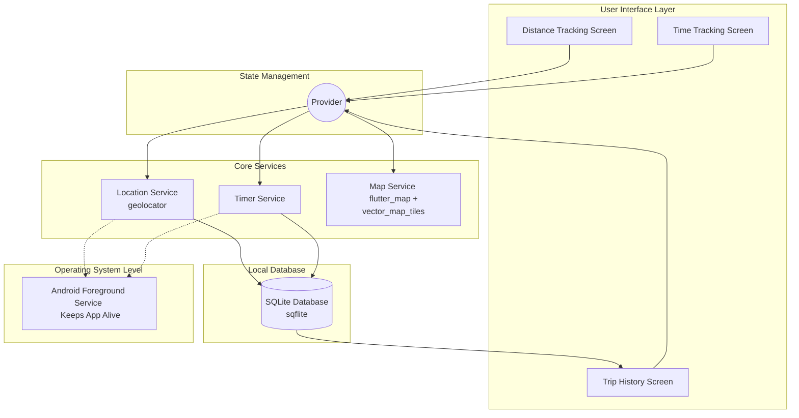

# Pagroo - Custom Offline Taximeter App 🚖

## 📖 Project Overview
Pagroo is a fully independent, 100% offline taximeter mobile application built with Flutter. Designed specifically for rideshare and online taxi drivers, this app allows users to seamlessly track trip fares based on customizable distance or time metrics without relying on cellular data.

## 💡 Motivation
This application is a personal project developed with a deep dedication to solving a real-world operational challenge for my father, a professional rideshare driver. It was built to provide an independent, highly customizable taximeter system that empowers drivers to set their own fare rates and operate reliably, even in challenging network conditions.

## ✨ Core Features

*   **Distance Tracking (GPS Meter):** Calculates trip distance independently using native device GPS sensors.
*   **Time Tracking (Timer Meter):** A robust background timer that calculates fares based on trip duration.
*   **100% Offline Vector Maps:** Integrates `flutter_map` and `vector_map_tiles` to render local `.mbtiles` map data (supporting regions like Jakarta, Surabaya, and Sidoarjo) directly from the device's storage, completely eliminating internet dependency.
*   **Haversine Signal Recovery:** Intelligent fallback system that calculates the straight-line distance between the last known coordinate and the reconnected coordinate if the GPS signal is temporarily lost.
*   **Advanced Trip History:** Stores all completed trips locally using SQLite (`sqflite`). Includes a detailed transparency log for GPS signal loss events and a mini-map route for distance-tracked trips.
*   **Driver-Centric UI/UX:** Built with high-contrast layouts, large touch targets, and a Dark/Light mode toggle to minimize cognitive load and glare while driving. Fares are localized with Indonesian Rupiah formatting.
*   **Persistent Background Tracking:** Utilizes Android Foreground Services (`flutter_foreground_task`) and `wakelock_plus` to ensure the tracking logic is never killed by the OS, even when the app is minimized or the screen is off.

## 🛠️ Tech Stack

*   **Framework:** Flutter (Dart)
*   **State Management:** Provider
*   **Database:** SQLite (`sqflite` bundled via `sqlite3_flutter_libs`)
*   **Maps Engine:** `flutter_map` (v7.x) & `vector_map_tiles` (for MBTiles vector support)
*   **Geolocation:** `geolocator` & `latlong2`
*   **Formatting:** `intl` (for localized currency formatting)

## 🏗️ System Architecture
The application strictly separates the UI layer from the background calculation logic using `Provider` to prevent screen freezing during intensive GPS calculations. Background operations are kept alive using Android Foreground Services.



## 📂 Project Structure
The codebase follows a clean, feature-first architecture to ensure scalability and separation of concerns:

*   **`lib/`**: Contains the core Flutter application source code (Dart), separated into features, models, screens, and services.
*   **`android/`**: Android-specific configurations, including the required background location and foreground service permissions.
*   **`assets/`**: Storage for bundled local assets, such as icons and offline map files.
*   **Documentation (`*.md`)**: Comprehensive engineering documents including `PRD.md`, `ARCHITECTURE.md`, `DESIGN.md`, and `implementation_plan.md` that outline the system's foundation.
*   **`pubspec.yaml` & `pubspec.lock`**: Flutter dependencies and version lock files.

## 🚀 Getting Started

### Prerequisites
*   Flutter SDK (Stable channel)
*   Android Studio (for Android toolchain and SDKs)
*   A physical Android device (highly recommended for testing GPS and background services).

### Installation
1. Clone the repository:
   ```bash
   git clone https://github.com/yosukeyung/Pagroo
   ```

2. Navigate to the project directory:
    ```bash
    cd Pagroo
    ```
3. Install dependencies:
    ```bash
    flutter pub get
    ```
4. Build and run the app:
    ```bash
    flutter run
    ```

## Map Setup (Testing)
To use the offline map feature, you need to provide your own vector .mbtiles file. You can extract free map areas from BBBike (select the standard MBTiles OpenStreetMap format without 'vector' for raster, or implement vector logic as configured) and place the direct download link within the Map Management settings in the app.

## 📝 License
This project is for personal use and portfolio purposes.

## 👨‍💻 Author

Yosuke Yung
CS Student @ BINUS UNIVERSITY